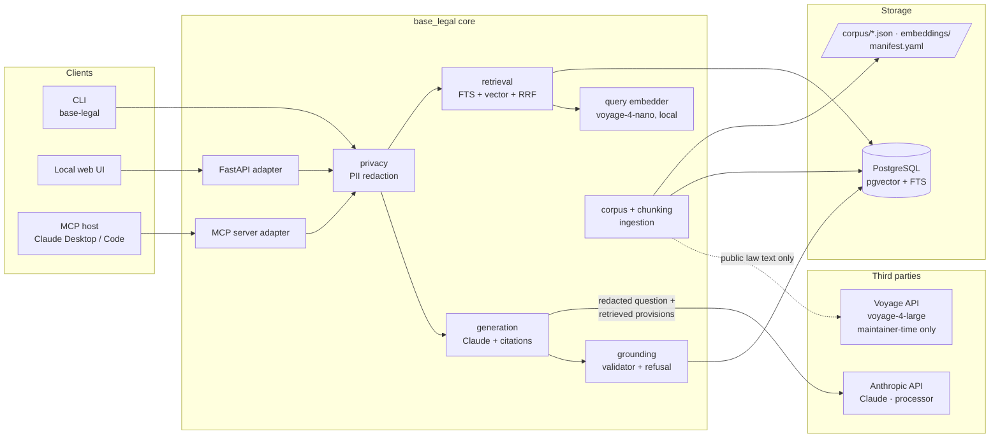
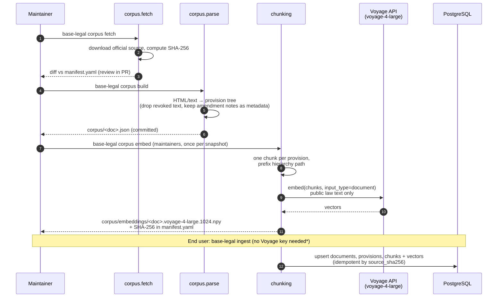
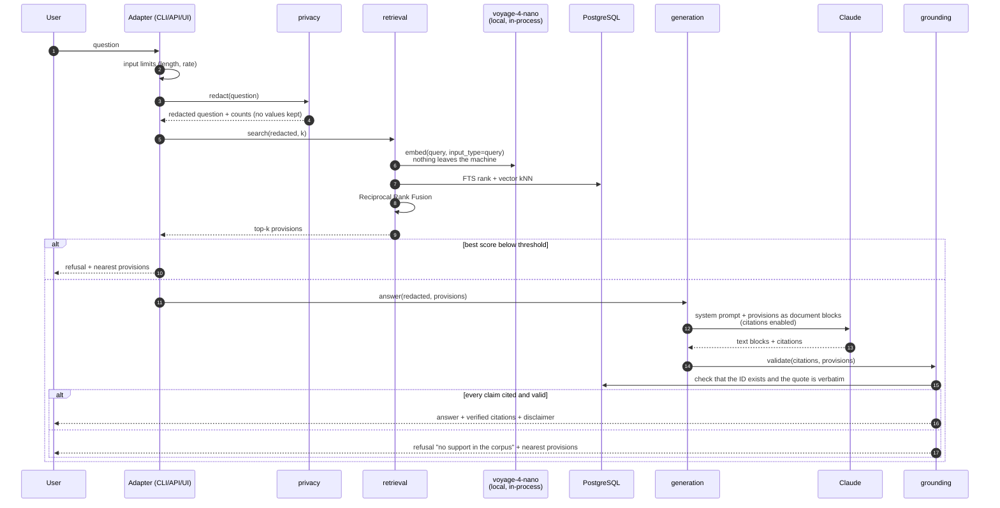
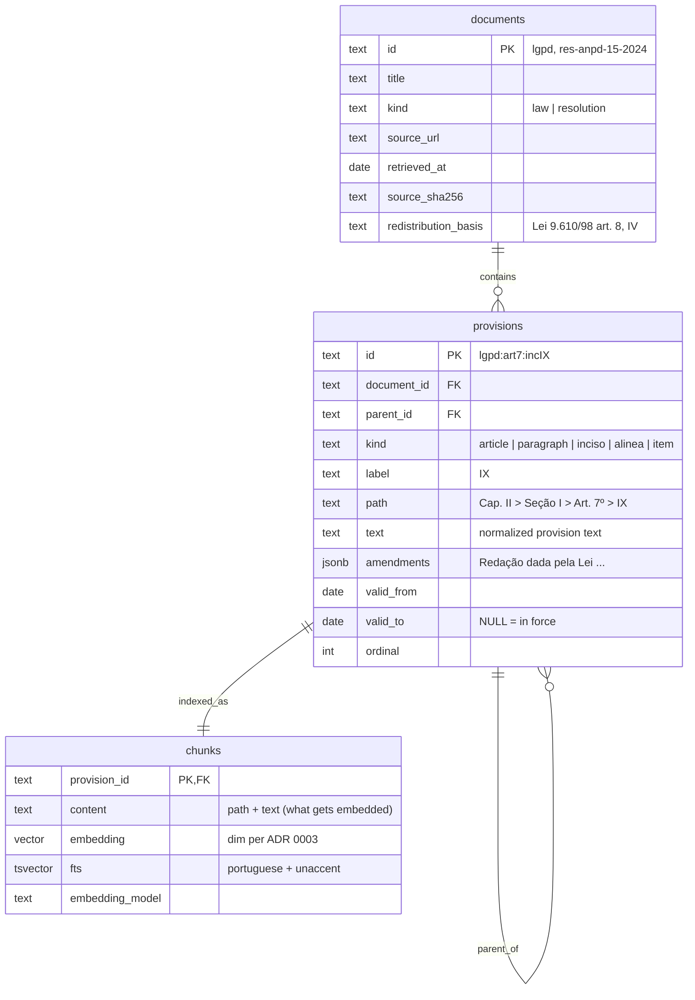

# Architecture

> Status: **draft for approval**. Decisions are recorded as ADRs in [`docs/adr/`](adr/).

## 1. Overview

A small Python library (`base_legal`) holds the whole pipeline. The CLI, the
HTTP API, the MCP server and the web UI are thin adapters over it.



Key properties:
- **Questions are embedded locally.** Voyage 4 models share one embedding
  space: the law is embedded once with `voyage-4-large` via the API, and
  questions are embedded in-process with the open-weight `voyage-4-nano`
  (ADR 0003). Voyage never receives user questions.
- **Anthropic is the only processor of user data**, and it only receives
  the question after the `privacy` module has redacted it.
- **The MCP path sends nothing to any third party.** The MCP server only runs
  retrieval (local embedding + Postgres); the host's own model writes the answer.
- **The MCP server never calls Claude.** It exposes retrieval and verification
  tools only; the host's own model writes the answer. It needs no Anthropic key
  and has no tool with side effects (OWASP LLM06).
- **The corpus is untrusted data.** Provision text is passed to the model as
  document content, never as instructions (see [THREAT_MODEL.md](THREAT_MODEL.md)).

## 2. Ingestion flow



- `fetch`, `build` and `embed` are separate on purpose. The normalized JSON
  (and, pending terms, the vectors) are committed, so CI and evals never
  depend on government websites or paid APIs.
- `ingest` picks a mode (ADR 0003): **precomputed** vectors when their hashes
  match the corpus snapshot; **api** to re-embed with `voyage-4-large`;
  **local** to embed documents with `voyage-4-nano` too (fully offline).
- \* If Voyage's terms turn out not to allow redistributing the vectors, users
  run `api` mode once (it fits the free allowance) or `local` mode.
- Ingestion is idempotent: re-running with an unchanged `source_sha256` does nothing.

## 3. Query flow



### Citation mechanism
Preferred approach (ADR 0005): Claude's native **Citations** feature, using
*custom content* documents in which **each content block is one provision**.
The API returns `content_block_location` indices, which map deterministically
to canonical provision IDs, and the `cited_text` comes from the supplied
document. The `grounding` validator still re-checks every citation (defense in
depth). In strict mode, any substantive text block without a citation triggers
a refusal.

Fallback, if Citations is unavailable for the chosen model or proves
unsuitable: structured outputs (`output_config.format`) returning
`{answer, citations: [{provision_id, quote}]}`, with the same validator.
The two cannot be combined in one request (the API rejects Citations together
with `output_config.format`).

`TODO(verify)`: Citations support on `claude-haiku-4-5`.

## 4. Canonical provision IDs

Format: `{doc}:{art}[:{par}][:{inc}][:{ali}][:{item}]`

| Provision | ID |
|---|---|
| LGPD art. 7, caput | `lgpd:art7` |
| LGPD art. 7, inciso IX | `lgpd:art7:incIX` |
| LGPD art. 11, inciso II, alínea "g" | `lgpd:art11:incII:alig` |
| LGPD art. 48, § 1º, inciso III | `lgpd:art48:par1:incIII` |
| LGPD art. 24, parágrafo único | `lgpd:art24:paru` |
| LGPD art. 55-J, inciso IV | `lgpd:art55J:incIV` |
| Res. 15/2024, art. 6 | `res-anpd-15-2024:art6` |
| Annex of Res. 19/2024, clause | `res-anpd-19-2024:anx1:…` (defined when parsing) |

| LGPD art. 65, inciso I-A | `lgpd:art65:incI-A` |

Rules: roman numerals for incisos (as in the source), lowercase letters for
alíneas. Article suffixes are appended in uppercase without the hyphen (`55J`,
unambiguous after digits). Inciso suffixes **keep the hyphen** (`I-A`),
because otherwise `I-C` would read as the roman numeral `IC`. IDs are
**stable across ingestions** and are part of the public API
(`src/base_legal/corpus/ids.py`).

## 5. Data model



- `valid_from` / `valid_to` exist from day one, so point-in-time queries
  (Phase 3) need no migration of existing data.
- No table stores user questions or answers. Eval runs write reports to files,
  not to the database.
- Indexes: HNSW on `chunks.embedding`, GIN on `chunks.fts`.

## 6. Modules

| Package | Responsibility | Notes |
|---|---|---|
| `corpus` | Fetch official sources, verify hashes, parse to a provision tree, write normalized JSON | One parser per source layout; test fixtures of the hardest articles |
| `chunking` | One chunk per provision, with the hierarchy path prefixed | Deterministic "contextual retrieval" without an LLM |
| `embeddings` | `Embedder` protocol; `voyage-4-large` (API, documents), `voyage-4-nano` (local, queries); shared-space guard | Weights pinned by revision + SHA-256, baked into the image (ADR 0003) |
| `store` | Schema, migrations, upserts, queries (psycopg 3) | No ORM magic in the query path |
| `retrieval` | FTS rank + vector kNN, RRF fusion (k = 60), score threshold | Postgres FTS is not true BM25 (ParadeDB/pg_search is an option) |
| `privacy` | PII detection and redaction (CPF/CNPJ with check digits, e-mail, phone), log policy | Placeholders like `[CPF_1]`; original values never stored |
| `generation` | Prompt assembly, Claude call, model selection | `claude-haiku-4-5` default, `claude-sonnet-5` via env |
| `grounding` | Validate citations, enforce strict refusal | Pure functions, heavily unit-tested |
| `api` | FastAPI app, input limits, security headers, serves the UI | OpenAPI documented |
| `mcp_server` | Tools `search_provisions`, `get_provision`, `verify_citation` | Read-only; stdio transport |
| `cli` | `corpus fetch/build/embed`, `ingest`, `search`, `ask`, `eval` | Typer |
| `evals` | Golden set and red-team runners, metrics, report + badge JSON | Deterministic in CI (local query embedder) |

## 7. Evaluation

| Metric | Definition | Where it runs |
|---|---|---|
| recall@k | Share of golden questions whose expected provision IDs appear in the top-k | CI (deterministic) |
| MRR | Mean reciprocal rank of the first expected provision | CI |
| citation validity | Share of emitted citations that pass the validator (target 100 %) | CI on recorded answers; locally on live runs |
| refusal accuracy | Out-of-scope or nonexistent-provision questions correctly refused | CI (retrieval threshold) + local (generation) |
| red-team pass rate | Injection and PII cases handled as specified | CI (deterministic parts) + local |
| faithfulness | LLM-judged support of the answer by its citations | Local / on demand only (cost) |

CI never calls paid APIs and needs no secrets, so it works on fork PRs.
Document vectors come from the committed `corpus/embeddings/`; golden-set
questions are embedded on the runner with `voyage-4-nano` (weights cached
between runs by revision hash).

## 8. Proposed repository layout

```
base-legal/
├── src/base_legal/
│   ├── corpus/          # fetch, parse, normalize
│   ├── chunking/
│   ├── embeddings/      # Embedder protocol, Voyage API + local nano
│   ├── store/           # schema, migrations, queries
│   ├── retrieval/
│   ├── privacy/
│   ├── generation/
│   ├── grounding/
│   ├── api/             # FastAPI + static UI
│   ├── mcp_server/
│   ├── cli/
│   └── evals/
├── corpus/              # normalized official acts + manifest.yaml
│   └── embeddings/      # precomputed voyage-4-large vectors (pending ToS check)
├── evals/
│   ├── golden.yaml
│   └── redteam.yaml
├── tests/
│   ├── unit/
│   └── integration/     # Postgres via Docker service in CI
├── docs/                # this documentation, ADRs, MkDocs source
├── .github/workflows/   # ci, evals, codeql, scorecard, pages, release
├── compose.yaml
├── Dockerfile
├── pyproject.toml
├── CLAUDE.md
├── README.md / README.pt-BR.md
├── LICENSE              # Apache-2.0
├── LEGAL_NOTICE.md      # corpus redistribution basis, not-legal-advice
├── SECURITY.md
└── CONTRIBUTING.md
```

## 9. Configuration

All configuration comes from environment variables (pydantic-settings) with
safe defaults: `ANTHROPIC_API_KEY`, `VOYAGE_API_KEY` (maintainers / `api`
ingest mode only), `BASE_LEGAL_MODEL`, `BASE_LEGAL_INGEST_MODE=auto`,
`BASE_LEGAL_QUERY_EMBEDDER=voyage-4-nano`,
`BASE_LEGAL_STRICT=true`, `BASE_LEGAL_LOG_QUESTIONS=false`,
`BASE_LEGAL_MAX_QUESTION_CHARS`, `DATABASE_URL`. Secrets are never read from
files committed to the repo.
